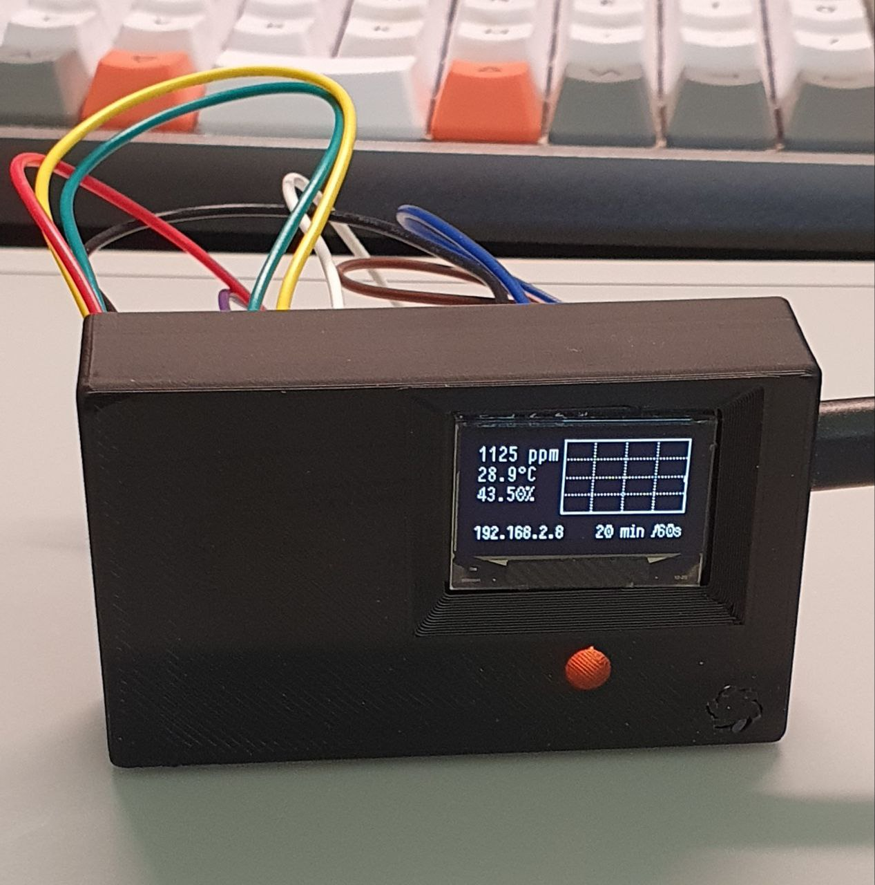
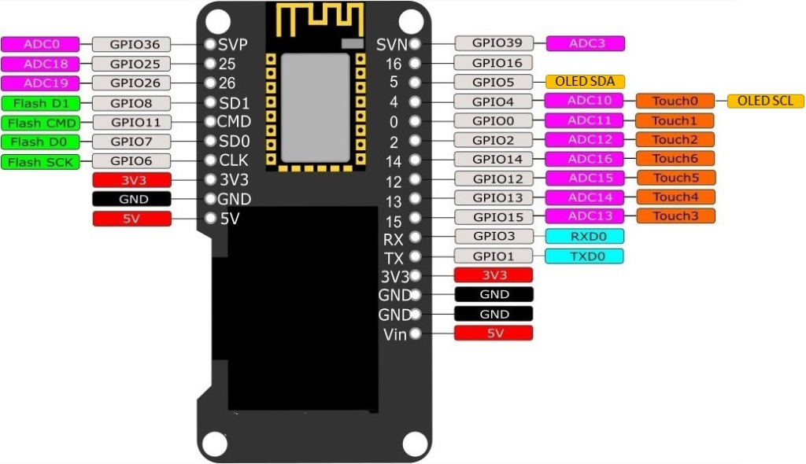
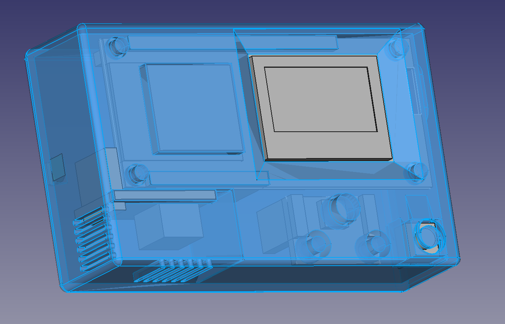
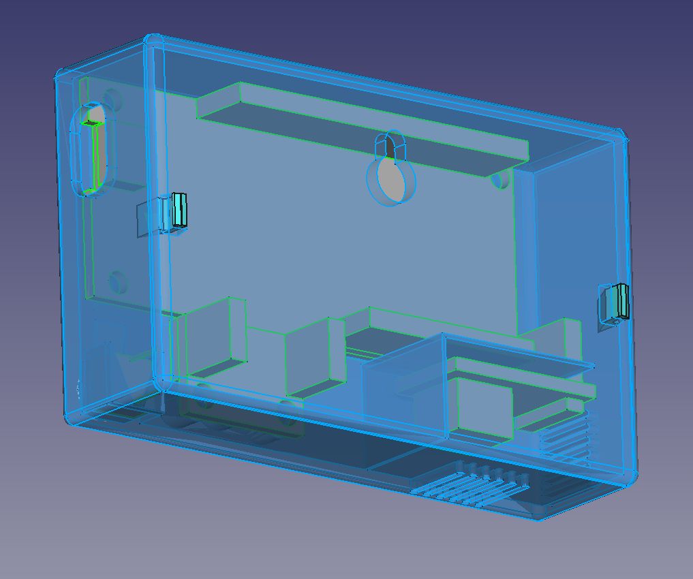
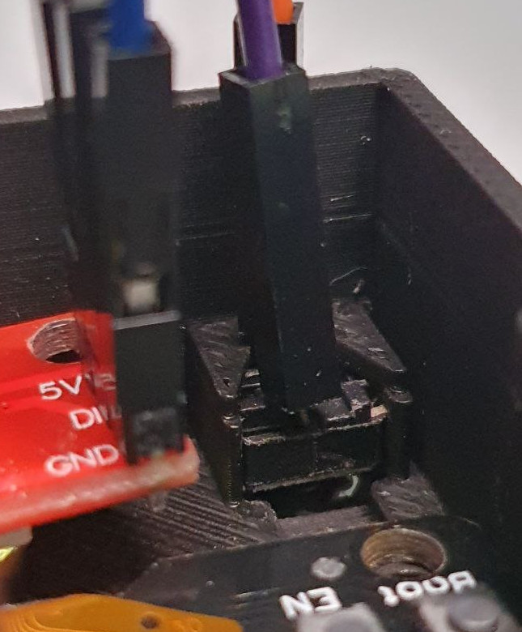
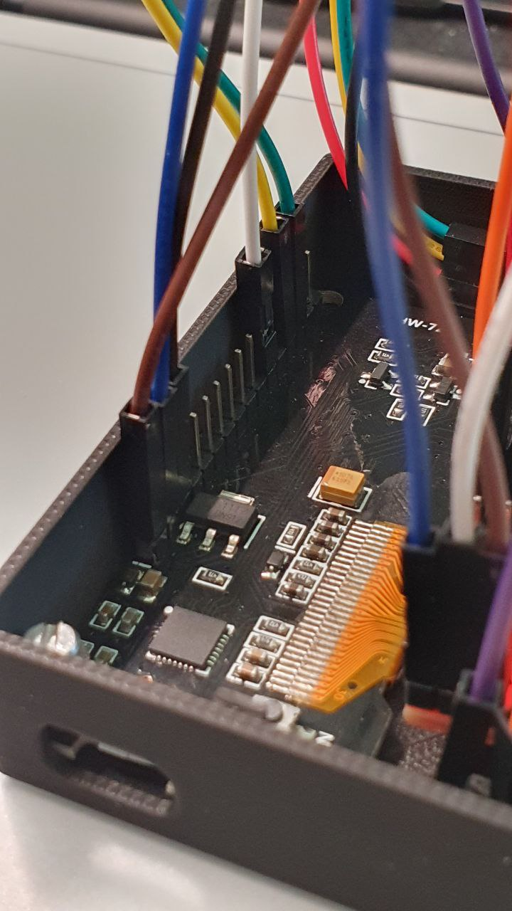
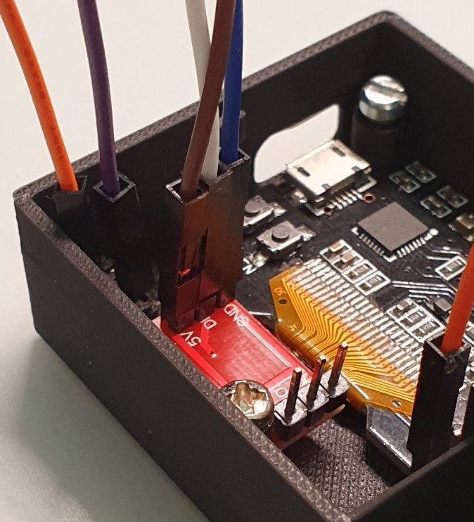
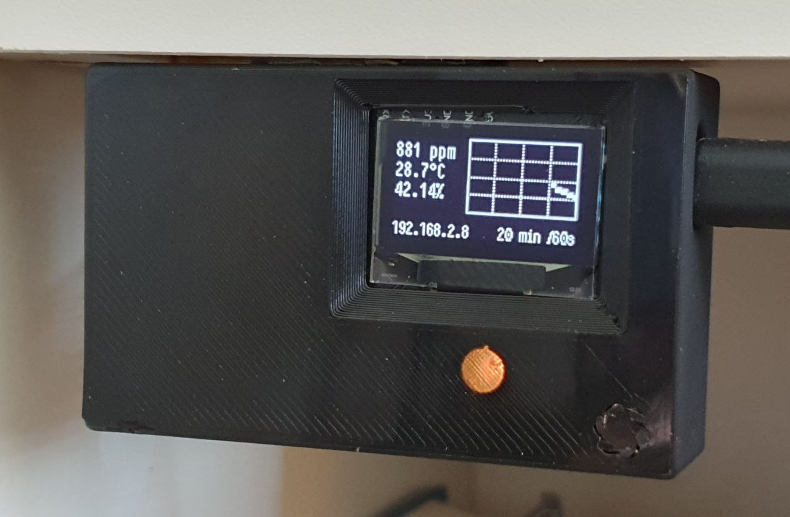
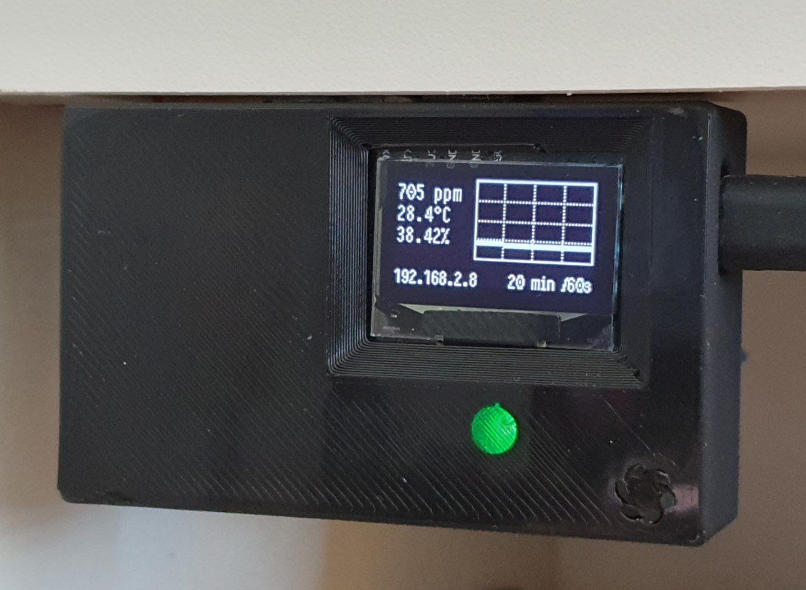

# DIY CO2 sensor with a printable case

 

Features:
- Measures CO2, temperature and humidity every 60 seconds
- Displays a graph with the CO2 values of the last 20 min / 2 hours 
- The RGB LED indicates current CO2 levels: green at 500ppm to red for 1800ppm
- A button with two actions: one short click to switch between 20min and 2h graphs, on long click to start a 10-min "fast polling" period (one measure every 5 seconds)
- Can be easily added to Home Assistant using the ESPHome integration: the device's IP address is on the screen

Hardware needed:
- ESP32 board: Wemos Lolin32 OLED (128x64px, uses SSD1306 on i2c)
- CO2 sensor: SCD40 by Sensirion
- RGB LED: a WS2812 breakout board (had to use neopixelbus platform as I encountered problems with fastled)
- A tactile switch (6x6x5mm) with two legs
- Some M3 screws if housing the device in the printed case

 

## Connecting the components

I'm using jumper wires but when my protoboards arrive I'll solder some headers and wire the board properly. With the headers, it will still be easy to pull components to use them in other projects.

**Wemos Lolin32 pinout:**
 
Source: [Wemos Lolin32 schematic](https://randomnerdtutorials.com/esp32-built-in-oled-ssd1306/)

Connections:
- i2c uses pins 4 (SCL) and 5 (SDA) for the display so the SCD40 needs to use those pins too
- SCD40 has a 2.4 - 5.5V supply voltage range (see [see datasheet](https://cdn.sparkfun.com/assets/d/4/9/a/d/Sensirion_CO2_Sensors_SCD4x_Datasheet.pdf)) so either 3.3V or 5V is fine
- The LED uses pin 2 for data, and 5V for power
- I put the button between 5V and GPIO25

## ESPHome config 

For installation of ESPHome, I'll let you refer to the [ESPHome doc](https://esphome.io/).

**Secrets**: to upload the `CO2Sensor.yaml` config to your board, you'll need a `secrets.yaml` file with WiFi credentials and OTA password – look at `secrets.example.yaml` for an example. 

**Fonts**: I use PragmataPro because it is nice and legible on a small display, but I can't share it due for licensing reasons. You either have to get it yourself and put it the `fonts` directory of your ESPHome directory, or [look at the ESPHome doc to change the `font:` section](https://esphome.io/components/display/index.html#fonts).

## Case

I wanted a printable case to house the device more cleanly than on a breadboard.

Design goals:
 - Able to hang on the wall
 - Printable without support
 - The CO2 sensor (SCD40) gets fresh air and is isolated from other components
 - Expensive components must be reusable in other projects: so no gluing and no soldering
 - Minimal footprint

I ended up with this design:
 
 

The current version of the case is available in STL or Step files in this repo.

### Printing the case

I printed my case face down with black PLA, a 0.4mm nozzle, 0.15mm layer height, 10% infill, using **arachne** wall generation for the button cover. After slicing, verify that the button cover looks printable at layers 1-3. You shouldn't need support for any part.

As I don't have short M3 screws, I created 2mm/5mm spacers to accommodate longer ones.

### Housing the components into the case

Need at least two M3 screws, and use 2mm/5mm spacers as needed if they are too long.

1. Slide button with two legs into position (using some tweezers if needed)
 
2. Ease the plastic button cover on the front of the case by actuating it a few times with a round tip. Make sure the button is still behind, or you could break the cover.
3. Before placing more components, note how the different wires are connected to the Wemos as its pins are not marked underneath! 
4. Screw in the Wemos Lolin32, putting at least one screw near the USB. 
 
5. Screw in the LED – preferably with two screws but you may get away with one.
 
6. Slide the SCD40 vertically into its slot on the bottom right of the case. I added some tolerance so it may be a bit loose. In this case, you can put a tiny piece of double sided tape between the vertical wall and the PCB.
 
7. Verify that all wires are connected to where they should be and you're done!

### Result

 
 

## Thanks

Many thanks to the [Fablab Renens](https://fablab-renens.ch/) and [FIXME](https://fixme.ch/) for organizing and hosting the [Capte Ton CO2 workshop](https://fixme.ch/node/220) that started my ESP32 and ESPHome journey!

