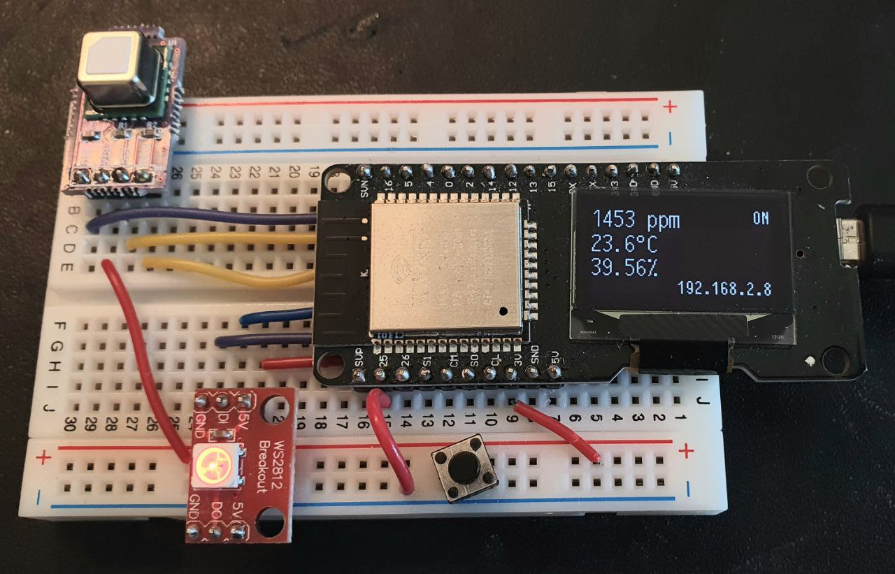
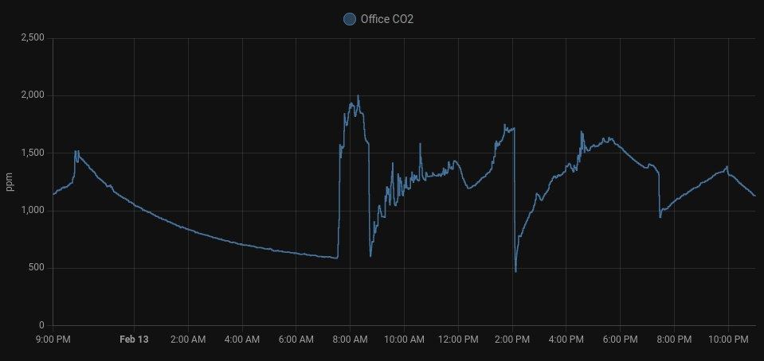
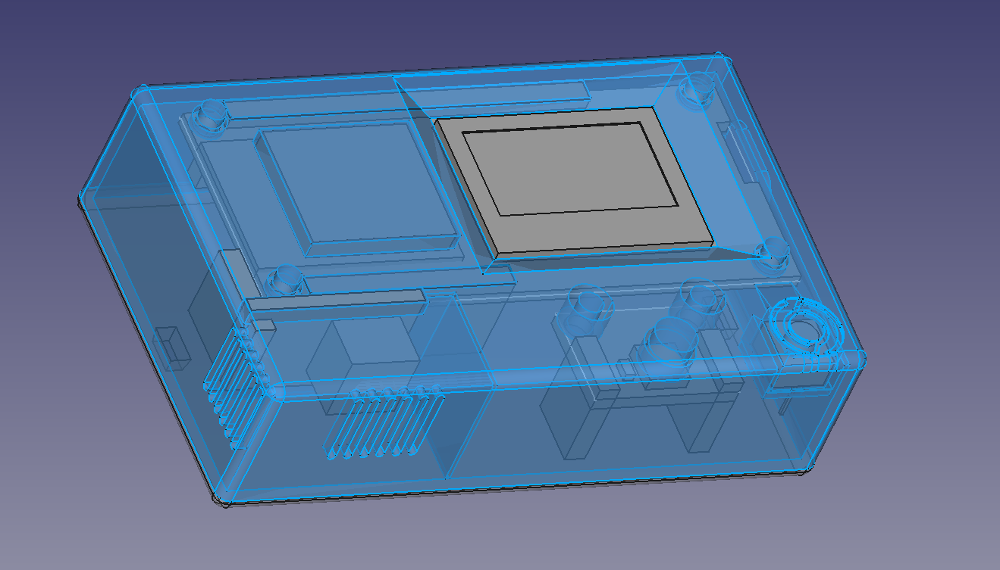

# CO2Sensor
ESPHome configuration for a self-contained CO2 sensor + display. 

 

Features:
- Measurements every 60 seconds
- Button: one click for instant read on sensor, long click to start a 10-min "fast polling" period with a measure every 5 seconds
- Visual indication of CO2 levels from green @500ppm to red @1800ppm
- Integration with Home Assistant
- On the display: CO2 ppm, temp and humidity, fast polling is active (ON/OFF), ip address if connected

Hardware:
- ESP32 board: Wemos Lolin32 OLED
- Oled display: SSD1306 on i2c, 128x64px
- CO2 sensor: SDC40
- RGB LED: WS2812 (had to use neopixelbus platform as I encountered problems with fastled)

 

## Case

Currently designing a printable case to house the components without the breadboard.

Design targets:
 - Able to hang on the wall
 - Printable without support
 - The CO2 sensor (SDC40) gets fresh air and is minimally impacted by the heat of other components
 - Expensive components must be reusable in other projects: so no gluing and no soldering
 - Minimal footprint

**V4**

